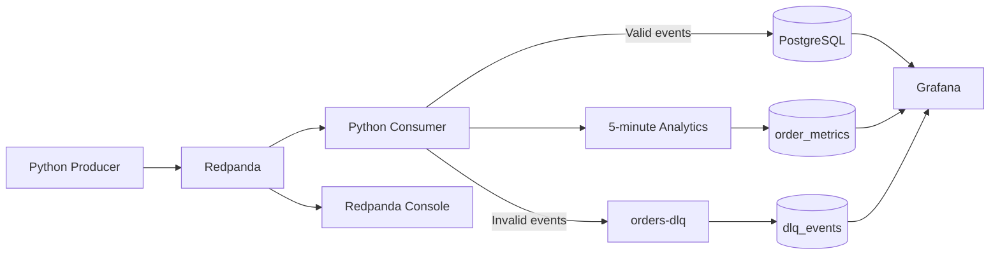

# Real-Time E-Commerce Data Engineering Pipeline

A small event-driven Data Engineering project that ingests simulated e-commerce orders in real time, streams them through Redpanda, validates and processes them with Python, stores valid records in PostgreSQL, routes invalid events to a Dead Letter Queue (DLQ), calculates 5-minute streaming metrics, and visualizes operational/business metrics in Grafana.

## Architecture



## Project Flow

1. The Python producer generates e-commerce order events.
2. Events are published to the `orders` Redpanda topic.
3. The Python consumer reads events using the Kafka-compatible `confluent-kafka` client.
4. Incoming events are validated for required fields, positive quantity, and positive price.
5. Valid events are inserted into PostgreSQL.
6. Invalid events are published to `orders-dlq` and logged in the `dlq_events` table.
7. Valid events are aggregated into 5-minute windows for order count, revenue, and average order value.
8. Window metrics are stored in `order_metrics` and visualized in Grafana.
9. Redpanda Console is used to inspect topics, messages, and consumer activity.

## Features

- Real-time event ingestion with Redpanda
- Kafka-compatible Python producer and consumer
- Data validation and malformed-event handling
- Dead Letter Queue for failed events
- PostgreSQL persistence
- Duplicate protection with `ON CONFLICT DO NOTHING`
- 5-minute windowed streaming analytics
- Revenue and Average Order Value calculations
- Grafana dashboard for business and pipeline-health metrics
- Redpanda Console for stream inspection
- Dockerized infrastructure
- Environment-based configuration with `.env`
- Git/GitHub version control

## Tech Stack

| Technology | Purpose |
|---|---|
| Python 3.12+ | Producer and stream-processing logic |
| Redpanda | Event streaming / Kafka-compatible broker |
| `confluent-kafka` | Python Kafka-compatible client |
| PostgreSQL 16 | Persistent and analytical storage |
| `psycopg2-binary` | PostgreSQL connectivity from Python |
| Docker Compose | Local infrastructure orchestration |
| Redpanda Console | Topic and message inspection |
| Grafana | Monitoring and visualization |
| `python-dotenv` | Environment-based configuration |
| Git / GitHub | Version control and portfolio hosting |

## Project Structure

```text
real-time-ecommerce-data-pipeline/
├── producer/
│   └── producer.py
├── consumer/
│   └── consumer.py
├── dashboard/
├── database/
├── docker-compose.yml
├── requirements.txt
├── .env.example
├── .gitignore
└── README.md
```

## Redpanda Topics

### `orders`

Main event stream for e-commerce orders.

### `orders-dlq`

Stores events that fail validation or JSON parsing.

## PostgreSQL Tables

### `orders`

Stores valid processed orders.

### `order_metrics`

Stores 5-minute window aggregates:

- window start
- window end
- order count
- total revenue
- average order value

### `dlq_events`

Stores failure metadata for invalid events:

- order ID
- error reason
- event time

## Getting Started

### Prerequisites

- Ubuntu/WSL or another Linux environment
- Python 3.12+
- Docker
- Docker Compose
- Git

### 1. Clone the repository

```bash
git clone https://github.com/YASEER6974/real-time-ecommerce-data-pipeline.git
cd real-time-ecommerce-data-pipeline
```

### 2. Create the environment file

```bash
cp .env.example .env
```

Edit `.env` with local values suitable for your machine.

### 3. Create the Python virtual environment

```bash
python3 -m venv .venv
source .venv/bin/activate
pip install -r requirements.txt
```

### 4. Start infrastructure

```bash
docker compose up -d
```

Services:

- Redpanda: `localhost:19092`
- Redpanda Console: `http://localhost:8080`
- PostgreSQL: `localhost:5432`
- Grafana: `http://localhost:3000`

### 5. Create Redpanda topics

```bash
docker exec redpanda rpk topic create orders
docker exec redpanda rpk topic create orders-dlq
```

Verify:

```bash
docker exec redpanda rpk topic list
```

### 6. Create PostgreSQL tables

Connect to PostgreSQL:

```bash
docker exec -it postgres psql -U user -d ecommerce
```

Create the required tables according to the project schema used by `consumer.py`:

```sql
CREATE TABLE orders (
    order_id VARCHAR(20) PRIMARY KEY,
    customer_id VARCHAR(20) NOT NULL,
    product VARCHAR(100) NOT NULL,
    category VARCHAR(50) NOT NULL,
    quantity INTEGER NOT NULL,
    price NUMERIC(10,2) NOT NULL,
    city VARCHAR(50) NOT NULL,
    timestamp TIMESTAMPTZ NOT NULL
);

CREATE TABLE order_metrics (
    window_start TIMESTAMPTZ PRIMARY KEY,
    window_end TIMESTAMPTZ NOT NULL,
    order_count INTEGER NOT NULL,
    total_revenue NUMERIC(12,2) NOT NULL,
    average_order_value NUMERIC(12,2) NOT NULL
);

CREATE TABLE dlq_events (
    id SERIAL PRIMARY KEY,
    order_id VARCHAR(20),
    error_reason TEXT NOT NULL,
    event_time TIMESTAMPTZ NOT NULL DEFAULT NOW()
);
```

### 7. Run the consumer

```bash
source .venv/bin/activate
python consumer/consumer.py
```

### 8. Run the producer

In another terminal:

```bash
cd real-time-ecommerce-data-pipeline
source .venv/bin/activate
python producer/producer.py
```

The producer generates valid events and intentionally injects malformed events for DLQ testing.

## Grafana

Open:

`http://localhost:3000`

Add PostgreSQL as a data source using the Docker service name:

- Host: `postgres:5432`
- Database: `ecommerce`
- User: value from `.env`
- Password: value from `.env`
- SSL Mode: `disable`

The dashboard can visualize:

- Total Orders
- Total Revenue
- Average Order Value
- Orders per 5-minute window
- Revenue per 5-minute window
- Average Order Value over time
- DLQ Events

## Data Quality and DLQ

The consumer validates required fields and business rules before writing to PostgreSQL.

Example invalid events include:

- missing customer ID
- missing product
- non-positive quantity
- non-positive price
- malformed JSON

Invalid events are isolated in `orders-dlq` and their failure metadata is recorded in `dlq_events`.

## Streaming Analytics

Valid events are grouped into 5-minute windows and aggregated using:

```text
revenue = price × quantity
average_order_value = total_revenue / order_count
```

This provides a simple example of windowed stream processing without introducing a heavier stream-processing framework.

## Observability

The project uses two complementary views:

- **Redpanda Console** for event-stream inspection
- **Grafana** for business and pipeline metrics

## Security / Configuration

Secrets and local configuration are stored in `.env` and excluded through `.gitignore`.

Do not commit real credentials, API keys, or tokens.

## Git Workflow

The project was developed incrementally with Git commits for major milestones:

- Initial project structure
- Streaming infrastructure and producer/consumer
- Data validation and DLQ
- Windowed streaming analytics
- Grafana monitoring and DLQ metrics
- Environment-based configuration

## Key Learning Outcomes

- Event-driven architecture
- Kafka-compatible streaming concepts
- Producers, consumers, topics, partitions, and consumer groups
- Data validation and failure isolation
- PostgreSQL data persistence
- Windowed streaming aggregation
- Docker networking
- Observability and dashboards
- Environment-based configuration
- Git/GitHub project workflow

## Future Improvements

- Separate services into additional Redpanda topics such as payments and shipments
- Add schema management and stronger data contracts
- Add automated tests and CI with GitHub Actions
- Add consumer-lag monitoring
- Add retry/reprocessing workflows for DLQ events
- Add a cloud deployment using AWS or another cloud platform
- Introduce a dedicated stream-processing framework for larger workloads

## Repository

https://github.com/YASEER6974/real-time-ecommerce-data-pipeline
